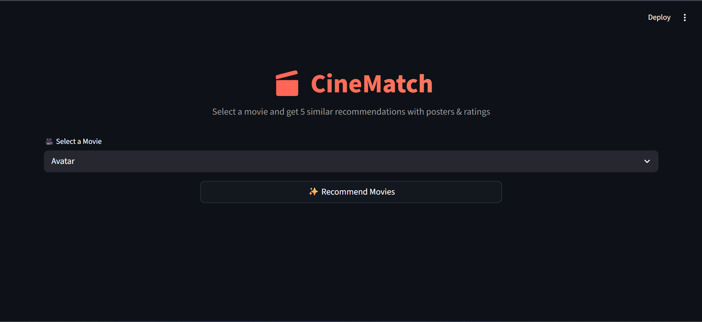
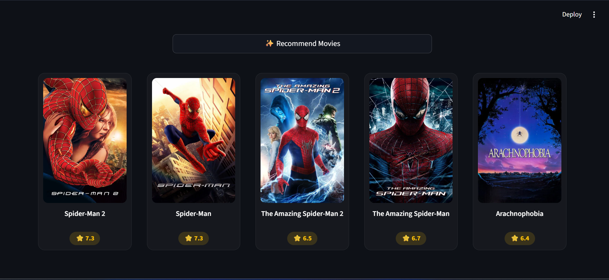
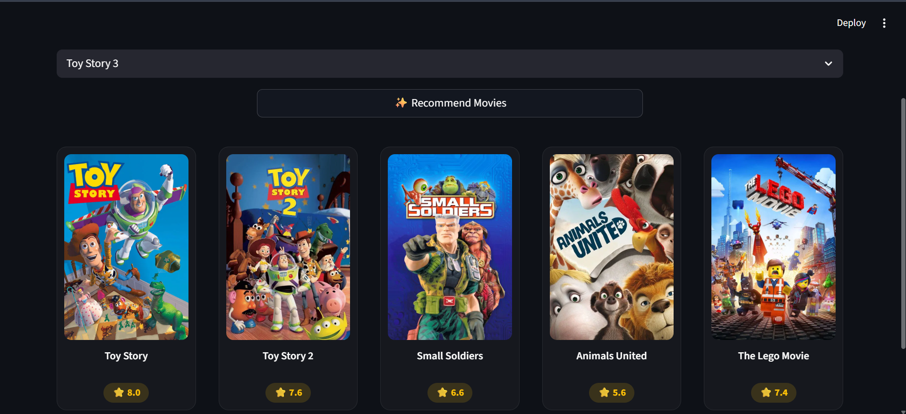

# 🎬 Movie Recommendation System

<p align="center">
  
  
  
</p>

<p align="center">
  A high-performance, Machine Learning-powered Content-Based Movie Recommendation System. Built using <b>Python</b>, <b>Scikit-Learn</b>, and deployed with an interactive <b>Streamlit</b> web application that fetches live movie posters via the <b>TMDB API</b>.
</p>

---

## 📌 Table of Contents
- [Features](#-features)
- [Tech Stack](#-tech-stack)
- [Screenshots](#-screenshots)
- [Project Structure](#-project-structure)
- [Machine Learning Workflow](#-machine-learning-workflow)
- [Installation & Usage](#-installation--usage)
- [Dataset Details](#-dataset-details)
- [Future Enhancements](#-future-enhancements)

---

## 📌 Features

*   **⚡ Smart Content Filtering:** Recommends 5 highly relevant movies based on genres, keywords, cast, and crew analysis.
*   **🖼️ Dynamic Poster Fetching:** Integrates live data extraction from the **TMDB API** to show visually appealing movie posters.
*   **🧠 Text Vectorization:** Implements Bag-of-Words via `CountVectorizer` and text normalization with NLTK's `PorterStemmer`.
*   **🌐 Modern UI:** Responsive, minimalist, and clean web layout using Streamlit.

---

## 🛠️ Tech Stack

| Category | Technologies & Libraries |
| :--- | :--- |
| **Language** |  |
| **Data & ML** |     |
| **Frontend/Web** |   |
| **API & Storage**| TMDB API, Pickle (Serialization) |

---

## 🖼️ Screenshots

Yahan application ka visual interface aur working flow dekh sakte hain:

## 📸 Screenshots

### 🏠 Home Interface


### 🎬 Recommendations Output


### 🍿 Extra Recommendations View

---

## 📂 Project Structure

```text
movie-recommender-system/
├── data/
│   ├── tmdb_5000_movies.csv
│   └── tmdb_5000_credits.csv
├── model/
│   ├── movies.pkl
│   ├── movies_dict.pkl
│   └── similarity.pkl (Generated locally)
├── home.png
├── recommendations.png
├── recommendation2.png
├── .gitignore
├── Movie_Recommendation_System.ipynb
├── README.md
├── app.py
└── requirements.txt
